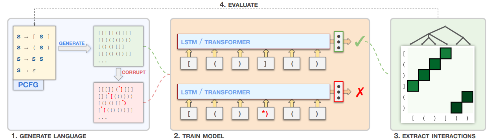

# Feature Interactions Reveal Linguistic Structure in Language Models

This repository contains the code for the ACL Findings 2023 paper _Feature Interactions Reveal Linguistic Structure in Language Models_, by Jaap Jumelet and Willem Zuidema.

Our pipeline consists of multiple stages: language generation (`fidameval.languages`), language model training (`fidameval.train`), and feature interaction extraction and evaluation (`fidameval.explain`). 

The `scripts` folder contains various scripts for replicating the experiments of the paper.

If you have any questions regarding the code or paper, please reach out to `jumeletjaap` `AT` `gmail.com`.